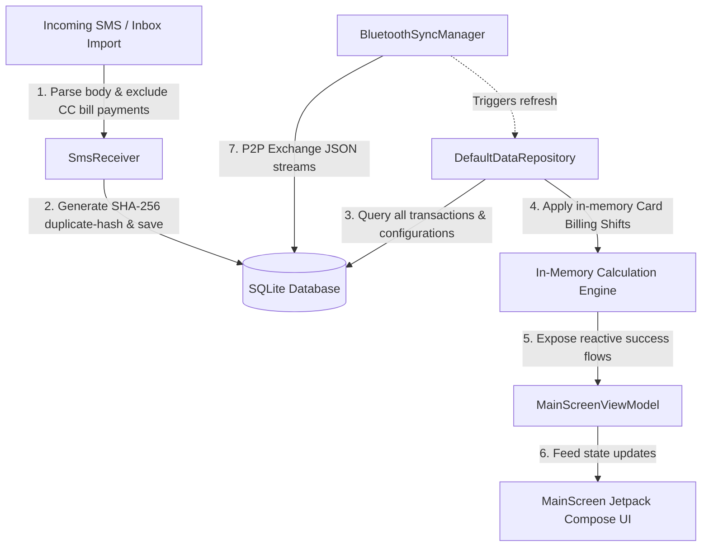

# 🛡️ NovaBudget

NovaBudget is a premium, high-fidelity, and **100% offline personal finance and expense tracker** built natively for Android. It operates under a strict, system-level privacy model with **zero network access** (no `INTERNET` permission declared in the manifest), ensuring that all transaction logs, financial habits, and account details remain strictly private to your device. 

The application automatically parses banking and credit card transaction SMS notifications locally, alerts you if you exceed your monthly budget, and synchronizes data bidirectionally with a spouse's phone completely offline using **Bluetooth Classic RFCOMM P2P sockets**.

---

## 🚀 Key Features

*   **🔒 100% Network-Sandboxed Privacy**: Built with absolute anti-leak privacy rules. The app contains no HTTP libraries, no analytics trackers, and **no internet access permissions**, rendering remote data leaks cryptographically impossible.
*   **📊 Dynamic Expense Categorization & Sub-grouping**: Seamless segmented toggle between list views and an expandable tree view of your expenses:
    *   **💳 Credit Card Spends**: Collapsible list per configured credit card.
    *   **🏦 Bank Account Spends**: Collapsible list per registered savings account.
    *   **💸 Cash & Others**: Category for manual entries.
    *   *Merchant Rollups*: Beautiful in-memory rollups summarizing total spent per merchant (e.g. `Swiggy: ₹1,450.00`).
    *   *Category Progress Rings*: Offline categorizer engine matching SMS bodies into 🍲 *Food & Dining*, 🛍️ *Shopping & Retail*, ⚡ *Bills & Utilities*, 🚗 *Commute & Travel*, and 📦 *Others*.
*   **🔄 Zero-Touch Spouse Auto-Sync**: Resilient, hands-free bidirectional synchronization via Bluetooth Classic. The background synchronization automatically triggers:
    1.  Immediately upon opening the app.
    2.  The second a new debit SMS is parsed and logged on your device.
    *   *Silent Failure*: Out-of-range checks fail silently in the background (no obstructive UI toasts).
    *   *Push Notifications*: Success triggers a clean local notification: `"Spouse Sync Complete: Auto-synced! Merged X new transactions."`
*   **📅 Historical Month-wise Expense Stats**: Elegant top-mounted dropdown selector to filter transaction history. The dynamic budget gauge, remaining balance, and itemized lists recalculate in real-time for any selected month.
*   **📥 Retroactive Inbox SMS Importer**: Scans local inbox SMS messages retrospectively for the **last 6 months** or **last 1 year**, parsing and logging expenses that occurred before the app was installed while automatically deduplicating previously logged entries.
*   **💳 Credit Card Billing Cycle Alignment**: Custom cutoff day configuration (1–28) per card. Any transaction made after the statement cutoff day is dynamically shifted in-memory to the next calendar month's budget to align perfectly with salary payoff schedules.
*   **🛡️ Smart CC Payment Exclusions**: Advanced parser filters that automatically identify bank account debits representing credit card bill payments (e.g., matching keywords like `"CC Payment"`, `"Card Pymt"`, `"Amazon Pay Credit C"`, `"credit card"`). These internal transfers are excluded from monthly spent calculations, avoiding budget double-counting.
*   **🎨 Premium Dark Slate & Emerald Aesthetics**: A beautiful obsidian dark-mode interface with floating glassmorphism cards, glowing emerald progress rings, and responsive transition micro-animations. Features a canvas-drawn native vector shield logo.

---

## 📐 Application Architecture

NovaBudget is engineered using modern Android development practices, utilizing **Jetpack Compose** for a fully reactive, single-activity declarative UI, and **Kotlin Coroutines / Flow** for thread-safe asynchronous stream propagation.

### System Data Flow



### Core Architecture Components

1.  **`SmsReceiver.kt` (Parser Layer)**:
    *   A custom `BroadcastReceiver` listening for `android.provider.Telephony.SMS_RECEIVED`.
    *   Uses custom regex patterns `(?i)(?:INR|Rs\.?|USD|\$)\s*([\d,]+(?:\.\d{2})?)` to extract spend amounts and capture merchants.
    *   Applies a smart double-counting prevention exclusion list.
    *   Triggers background P2P synchronizations and local system notifications upon logging a new transaction.
2.  **`NovaDatabaseHelper.kt` (Database & Schema Layer)**:
    *   A thread-safe `SQLiteOpenHelper` handling persistent data schemas.
    *   Manages tables for `transactions` (with a unique SHA-256 hash constraint to prevent duplicates), `card_configs` (Version 2, supporting custom billing cutoff columns), and `account_configs`.
3.  **`DataRepository.kt` (Repository & In-Memory Shifting Engine)**:
    *   A thread-safe singleton repository pattern exposing data flows.
    *   Implements the in-memory **Billing Cycle Shift Engine**: reads transaction timestamps, evaluates the transaction against active credit card rules, and shifts the target budget month forward if the transaction occurred past the card's billing cutoff day.
4.  **`BluetoothSyncManager.kt` (Bluetooth Classic P2P Layer)**:
    *   Manages custom bidirectional socket syncing.
    *   **Host Mode**: Launches a continuous background `AcceptThread` listening on RFCOMM using a designated secure UUID.
    *   **Client Mode**: Establishes a secure connection via `ConnectThread` to a paired spouse device, exchanges JSON-serialized transaction payloads (with custom size headers to prevent socket buffer fragmentation), and merges records natively using SQLite `CONFLICT_IGNORE` rules.
5.  **`MainScreenViewModel.kt` (State Holder)**:
    *   Combines flows from the `DefaultDataRepository` (transactions, configs, budget limits, active months) into a unified, read-only `MainScreenUiState.Success` stream using nested state flows.
6.  **`MainScreen.kt` (UI Presentation Layer)**:
    *   Constructs 4 distinct screens (Dashboard, Expenses, Rules, and P2P Sync) using modern Material 3 Compose layouts, optimized with glassmorphic cards, custom canvas widgets, and dynamic responsive states.

---

## 🛠️ Getting Started

### Prerequisites
*   **Android Studio Jellyfish / Ladybug (or higher)**
*   **Android SDK 34 / 35**
*   **JDK 17** (Ensure your Gradle Java version in Android Studio is mapped to JDK 17)

### Local Configuration
1.  Clone the repository to your local machine:
    ```bash
    git clone https://github.com/yourusername/expense-tracker.git
    cd expense-tracker
    ```
2.  Open the project in **Android Studio**.
3.  Wait for the Gradle Sync to complete. The project automatically configures standard compiler flags and retrieves Android Gradle Plugin dependencies.

---

## 📦 Building and Running

You can compile and build the Android application binaries directly using the bundled Gradle wrapper in your terminal:

*   **Build Debug APK** (standard testing build):
    ```bash
    ./gradlew assembleDebug
    ```
    *Output location*: `app/build/outputs/apk/debug/app-debug.apk`

*   **Build Release APK** (fully optimized, signed with debug keys for side-loading):
    ```bash
    ./gradlew assembleRelease
    ```
    *Output location*: `app/build/outputs/apk/release/app-release.apk`

---

## 📲 Manual Verification Instructions

NovaBudget comes pre-populated with default configurations for out-of-the-box evaluation matching standard transaction formats:
*   **Pre-configured Card**: Last digits `1234` (labeled `Dummy Credit Card`), keywords `spent,debited,charged`, billing cutoff `0` (calendar month).
*   **Pre-configured Bank Account**: Last digits `5678` (labeled `Dummy Bank Account`), keywords `debited`.

### 1. Verification of Payment Exclusions (Double-Counting)
1.  Open the app. Go to **Dashboard** and set your budget limit to ₹50,000.
2.  Simulate/receive a bank account debit SMS representing a credit card payment:
    > `"INR 36638.52 debited A/c no. XX5678 on 31-01-26, 19:28:53 UPI/P2M/603115236116/Amazon Pay Credit C Dummy Bank"`
3.  **Result**: The parser will match `"Amazon Pay Credit C"`, identify it as a credit card payment exclusion, and discard it. Verify that the transaction is ignored (it will **not** appear in your expenses list or inflate your total monthly spent).

### 2. Verification of Credit Card Billing Cycles
1.  Go to the **Rules** tab (3rd tab).
2.  Locate *Dummy Credit Card (Ends in 1234)*, tap the **Edit Pen icon**, set the **Billing Cutoff Day** to `18`, and tap **Save Changes**.
3.  Navigate to the **Expenses** tab and add a manual transaction for **April 20th** for ₹500 using *Dummy Credit Card*.
4.  Navigate back to the **Dashboard** (1st tab), and select the month **May 2026** in the top-right month dropdown.
5.  **Result**: Because April 20th is past the billing cutoff day of 18, the ₹500 spend has been automatically shifted to May's budget! Verify that it appears under the May 2026 statement spent.
6.  Add another transaction on **April 15th** for ₹300. Select **April 2026** in the dropdown. Verify that this transaction remains counted under April's budget.

### 3. Verification of Zero-Touch Sync
1.  Turn on Bluetooth on both devices and pair them in Android System Settings.
2.  Launch NovaBudget on both phones. Go to the **Sync** tab (4th tab), and select your spouse's paired device from the list.
3.  Simulate a debit SMS on Phone A.
4.  **Result**: Phone A will automatically parse the SMS, open a silent background Bluetooth socket connection to Phone B, and merge the transaction records. Phone B will receive and display a local system notification detailing the success.
